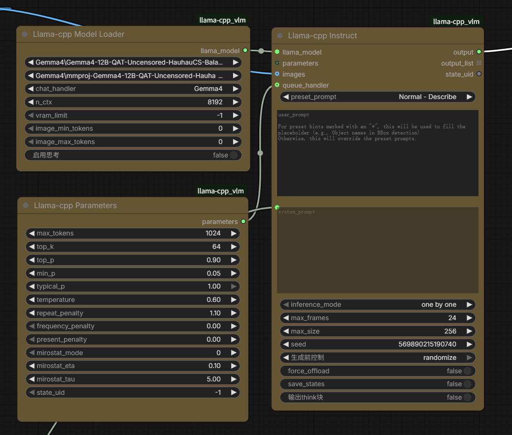

# ComfyUI-llama-cpp_vlm - Gemma4 Thinking Controls Fork

**中文说明见 [README.md](./README.md)。**

This is a personal fork of [lihaoyun6/ComfyUI-llama-cpp_vlm](https://github.com/lihaoyun6/ComfyUI-llama-cpp_vlm), which itself is based on [kijai/ComfyUI-llama-cpp](https://github.com/kijai/ComfyUI-llama-cpp).

The main purpose of this fork is to make Gemma4 image prompt reverse engineering more convenient in ComfyUI, especially when using Gemma4 GGUF vision models that may emit thought/channel text.

## Preview



## What changed in this fork

- Added `启用思考` to `Llama-cpp Model Loader`.
  - For `Gemma4`, this passes `enable_thinking` to `Gemma4ChatHandler`.
  - Default: `false`.
- Added `输出think块` to `Llama-cpp Instruct`.
  - Default: `false`.
  - When disabled, output cleanup removes common think/channel markers such as `<think>...</think>` and `<|channel>thought ... <channel|>`.
- Updated default sampling parameters in `Llama-cpp Parameters`:

```text
temperature: 0.6
top_k: 64
top_p: 0.9
min_p: 0.05
repeat_penalty: 1.1
```

These defaults follow the recommended sampling values listed by the HauhauCS Gemma4 uncensored model card.

## Important note: recreate old workflow nodes

After installing or updating this fork, old ComfyUI workflows may not immediately show the newly added widgets on existing nodes.

For best results, delete and recreate these related nodes from ComfyUI search:

```text
Llama-cpp Model Loader
Llama-cpp Parameters
Llama-cpp Instruct
```

Recreated nodes will show `启用思考`, `输出think块`, and the updated default sampling parameters.

## Tested model

This fork was mainly tested with:

[HauhauCS/Gemma4-12B-QAT-Uncensored-HauhauCS-Balanced](https://huggingface.co/HauhauCS/Gemma4-12B-QAT-Uncensored-HauhauCS-Balanced)

Model files mentioned by the model card:

```text
Gemma4-12B-QAT-Uncensored-HauhauCS-Balanced-Q4_K_M.gguf
mmproj-Gemma4-12B-QAT-Uncensored-HauhauCS-Balanced-BF16.gguf
```

Place GGUF model files under:

```text
ComfyUI/models/LLM
```

Then select the main model and the matching `mmproj` file in `Llama-cpp Model Loader`.

## Suggested settings for image prompt reverse engineering

For normal image prompt reverse engineering:

```text
启用思考: false
输出think块: false
temperature: 0.6
top_k: 64
top_p: 0.9
min_p: 0.05
repeat_penalty: 1.1
frequency_penalty: 0.0
present_penalty: 0.0
```

If you want to inspect raw thinking/channel output for debugging, enable `输出think块`.

If you enable `启用思考`, generation may become slower because the model may produce more reasoning tokens before the final answer.

## Installation

Clone this fork into ComfyUI `custom_nodes`:

```bash
cd ComfyUI/custom_nodes
git clone https://github.com/redpigirl214/ComfyUI-llama-cpp_vlm.git
```

Install requirements only if your ComfyUI environment does not already have the required dependencies:

```bash
python -m pip install -r ComfyUI-llama-cpp_vlm/requirements.txt
```

For existing ComfyUI environments, review dependency versions before installing requirements.

## Credits

- Original fork: [lihaoyun6/ComfyUI-llama-cpp_vlm](https://github.com/lihaoyun6/ComfyUI-llama-cpp_vlm)
- Upstream project: [kijai/ComfyUI-llama-cpp](https://github.com/kijai/ComfyUI-llama-cpp)
- [llama-cpp-python](https://github.com/JamePeng/llama-cpp-python)
- [ComfyUI](https://github.com/comfyanonymous/ComfyUI)
